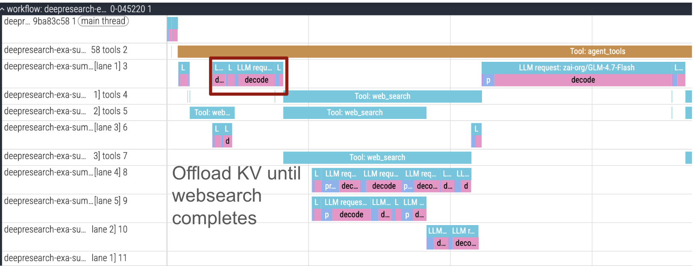
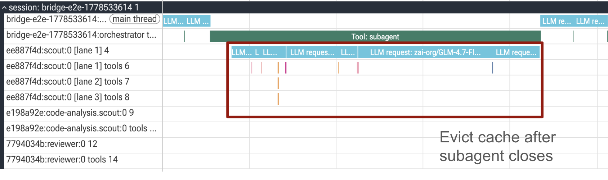

# RFC: Router-Initiated KV Cache Hints

## TLDR

SGLang should expose a **router-initiated KV-cache hint** surface. This allows an external orchestrator (ex. Dynamo router) to pass structured cache intent to SGLang without directly manipulating KV-cache internals. SGLang parses the hint, validates it, and lets the scheduler/KV-cache manager decide whether to accept, clip, defer, or ignore it.

Examples of some hints include:

- **Share:** reuse KV from another worker or shared tier.
- **Prefetch / Onboard:** move likely-needed KV into a hotter tier.
- **Demote / Offload:** move KV to a colder tier during idle gaps.
- **Priority:** bias block-level offload/onboard policy.
- **Pin / Retain:** preserve high-value prompt KV for a bounded window.
- **Session Lifecycle:** tag subagent/session KV and handle close-time cleanup
  or demotion.

The first concrete implementation is Shared HiCache. The Dynamo router sends
`cache_hints.shared_hicache`, and SGLang uses native HiCache/radix machinery to
pull source `CPU_PINNED` KV into target `GPU` KV. The hint carries logical cache
identity and block hashes; concrete transport routes are runtime configuration,
not request payload. This implementation provides the API surface needed for
future hints because the machinery to move KV natively between workers will be
present.

## Motivation

Agentic inference creates KV-cache patterns that are visible above the engine
but invisible to request-local cache policy.

### Stable Prefixes

Agent trajectories often carry large stable prefixes:

- system prompt
- skills/guidance docs
- repository or workspace context
- task instructions
- tool outputs

The next request may only add a small suffix and missing on the stable prefix
causes a very expensive prefill recomputation.

### Tool Latency

Tool calls have a wide latency distribution:

- local shell command: milliseconds;
- local code search: milliseconds to seconds;
- web/API call: seconds;
- external service wait: minutes.

The right KV policy depends on that latency. As an example, a long tool call (i.e web-search) could allow for KV for that request to be offloaded until the web-search returns.



## Problem Statement

SGLang has HiCache, but no general way for a an orchestrator to express cache intent at the request/trajectory level. HiCache is also tightly coupled with the scheduler (for good reason). A design that asks an external system to directly manipulate cache-manager internals would be brittle. It would either duplicate scheduler policy outside the engine or require a large refactor of the scheduler/cache-manager boundary.

Instead - with our router initated hint approach, we want to:

- keep scheduling and memory ownership inside SGLang HiCache
- expose a narrow hint surface at request/lifecycle boundaries
- let router/workload policy soft influence cache behavior
- make each hint observable, bounded, and safe to reject

Current shape:

```text
request arrives
  |
  v
router chooses target worker
  |
  v
target worker checks local cache
  |
  +-- hit: reuse
  +-- miss: recompute or use local offload policy
```

This is insufficient when:

- a router knows another worker has the prefix;
- the workload knows a request will resume soon;
- the workload knows a session has ended and its KV should be deprioritized or
  demoted;
- the orchestrator wants to pin high-value prompt KV;
- the engine's local policy cannot distinguish a 10 ms tool gap from a 10 minute
  tool gap.

The missing abstraction is an API surface where the orchestrator can bias the cache manager to be smarter about how the KV cache is treated.

## Proposal

Add a structured `cache_hints` surface that can be carried in requests and, for
lifecycle events between requests, exposed through a lightweight control path.

The primary producer should be the router/orchestrator layer. Workloads can
still generate intent, but the router is the natural place to merge workload
context with global KV placement, worker load, health, and admission policy.

Request-scoped envelope:

```json
{
  "cache_hints": {
    "<hint_type>": {
      "...": "hint-specific payload"
    }
  }
}
```

This RFC only standardizes the parent envelope. Individual hint payloads should
be specified in their own RFCs. The first concrete payload is
`cache_hints.shared_hicache`, described in the detailed Shared HiCache RFC.

## Why Router-Initiated

KV Routers (like the Dynamo router) have a few properties that make it the perfect place for these hints to originate
1. We have a **global** view of each KV block from events.
2. It has built in high-availabiilty and fault tolerance.
3. It already handles routing based on overlap/load and has built in policies for admission control
4. With our new harness <-> orchestrator work, we are now also trajectory aware (as opposed to just request aware)

## Hint Types

### Priority

Set block-level cache priority.

Use cases:

- make a system prompt harder to evict;
- lower priority for ephemeral subagent scratch KV;
- bias offload/onboard decisions by block importance;
- preserve planner context over low-value intermediate tokens.

The unit should be logical blocks, prefixes, sessions, or tagged token ranges.
SGLang maps those logical targets to physical KV pages. This already exists in sglang!

### Pin / Retain

Keep important KV resident, or at least protect it from ordinary eviction for a
bounded TTL.

Use cases:

- high-value prompt prefix;
- expensive retrieved context;
- shared planner state;
- short tool-call gap where recompute would dominate latency.

Pinning must be bounded by TTL, memory pressure policy, and engine admission
rules. It should never become an unbounded memory leak.

### Prefetch / Onboard

Move KV into a hotter tier before it is needed.

Use cases:

- prefetch after a tool call is expected to return;
- onboard a likely next-turn prefix into GPU;
- warm a newly selected worker before routing a continuation;
- pull shared KV from host/storage into the target cache.

The engine can execute this synchronously, asynchronously, or not at all,
depending on deadline and pressure.

### Session Lifecycle

Tag KV by session or subagent lifecycle so SGLang can apply lifecycle-aware
cache policy. This already exists via `SessionCache` and Dynamo uses it for subagent KV cache lifecyle

Use cases:

- subagent session opened;
- subagent session closed;
- retry path abandoned;
- compaction made old blocks lower value;
- user session paused or closed.

This already exists via `SessionCache` and Dynamo uses it for subagent KV cache lifecyle
When a subagent ends, the router asks SGLang to mark its KV for cleanup and/or demote reusable blocks to HiCache
instead of leaving everything in GPU until local pressure eventually finds it.



### Demote / Offload

Move KV from a hotter tier to a colder tier instead of dropping it.

Use cases:

- long external tool call;
- paused trajectory;
- low-priority subagent state that may still be useful;
- memory pressure where recompute is expensive but GPU residency is not worth
  keeping.

Demotion should include a target tier when possible: host, disk, or external.

### Share

Reuse KV that already exists on another worker or shared tier.

Use cases:

- route a continuation to a less-loaded worker while pulling prefix KV from the
  old worker;
- share a common prefix across sibling subagents;
- warm a scale-up worker from an existing worker.

The current Shared HiCache PR implements this category for source
`CPU_PINNED` -> target `GPU` reuse.

## Integration Points

The hint surface should wire into four places.

1. Request ingress - validate `cache_hints` shape
2. Scheduler - act on the hint and schedule
3. HiCache - own the physical effects (lookup, page protection, demotion, etc)

## First Implementation: Shared HiCache

Shared HiCache is the first implementation of this model.

It adds one hint:

```json
{
  "cache_hints": {
    "shared_hicache": {
      "...": "router-provided peer reuse plan"
    }
  }
}
```

The Dynamo router provides a plan that says another worker has a useful prefix in
`CPU_PINNED` HiCache. SGLang validates the plan, asks the source worker to
protect the host pages, transfers them into target GPU KV, and inserts them into
the local radix cache.

This is intentionally the smallest first hint:

- it uses the router/indexer global KV view;
- it does not require a workload-specific extension;
- it is default-off;
- it is native to SGLang's HiCache/radix machinery;
- it leaves scheduler/cache-manager ownership inside SGLang.

Detailed RFC: [Shared HiCache](SHARED_HICACHE_RFC.md).
