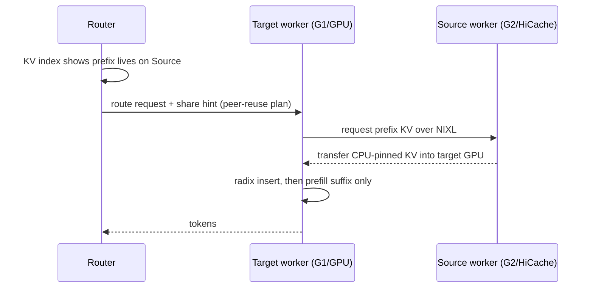
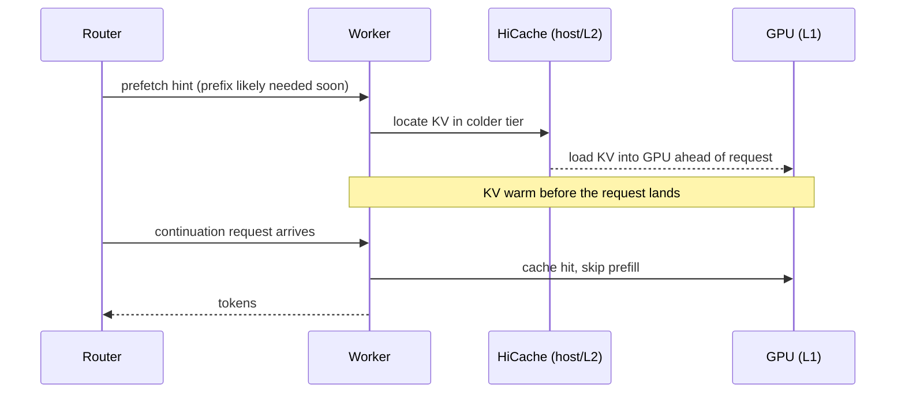
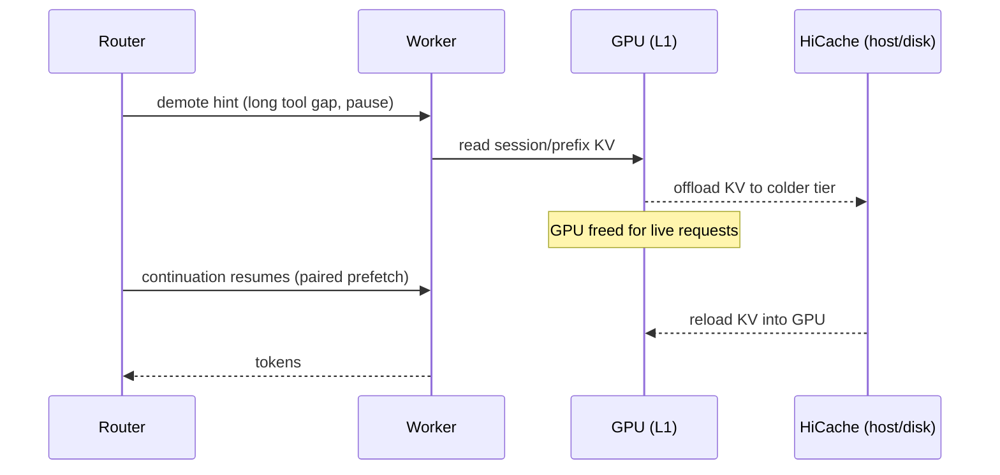

# RFC: Programmatic KV Cache for Agentic Workloads

Authors: @ishandhanani, @hzh0425

## Introduction 

> [!NOTE]  
> Note: For this RFC, we will define “router” as an orchestrator on top of multiple engine units. 

Agent workloads make the value of a KV block predictable from above the engine, but that value is invisible to request-local LRU. We propose exposing a narrow, router-initiated hint surface so an external router can pass cache intent to SGLang without making invasive changes to the engine scheduler and cache manager. In this way, SGLang keeps ownership of scheduling and memory and is free to clip, defer, or reject any hint. 

The first concrete hint we propose is Shared HiCache. This allows for a router to request KV cache to be moved from a workers G2 to another workers G1 directly within HiCache without a need for a secondary memory pool. This scaffolding paves the way for various other KV transfer mechanisms that directly improve performance of agentic inference.

---

## Motivation

Agentic inference has patterns that can be exploited for smarter scheduling and KV management. Some examples:

- **Stable prefixes dominate a turn**:  System prompt, skills/guidance, repo and workspace context, task instructions, and prior tool outputs all carry over; the new request often appends only a small suffix. Missing on the prefix forces an expensive prefill.
- **Tool-call latency spans orders of magnitude**:  can span orders of magnitude. A local shell command is milliseconds; an external service wait is minutes. The right KV policy depends on that gap, and request-local policy cannot see it.
- **Context is not append-only**: Deep-agent loops compress, summarize, and refine history and swap skills/tool definitions mid-trajectory. The engine keeps KV for context the agent might have already discarded - zombie cache.
- **Subagent lifecycle is a signal**: When a subagent spawns, the main-agent KV should be immediately evictable and prefetched back on close. When a subagent returns a summary, its scratch KV is dead and should not linger.
- **Concurrency causes KV thrash**: Interleaved agents evict each other's still-live prefixes under load.

## Problem Statement

The orchestrator knows the structure request-local policy cannot: which sessions are live, which token ranges are shared prefixes vs unique tails, which tool gap is 10ms vs 10min, when a subagent opened and closed. The engine sees a block hash and a refcount.

Current shape:

```text
request arrives
  -> router chooses target worker via KV overlap/load
  -> target worker checks local cache
       hit:  reuse
       miss: recompute or apply local offload policy
```

This is insufficient when: 
- another worker already holds the prefix; 
- the workload knows a request will resume soon; 
- a session has ended and its KV should be demoted/freed; 
- the orchestrator wants to protect high-value KV; 
- or local policy cannot tell a short tool gap from a long one.


The missing abstraction is a precise, observable surface where the orchestrator biases the cache manager without owning scheduler or memory internals. Letting an external system manipulate cache internals directly is the wrong design: it is brittle, it duplicates scheduler policy outside the engine, and it forces a refactor of the scheduler/cache-manager boundary. Hints keep ownership inside SGLang and let the orchestrator soft-influence behavior at request and lifecycle boundaries.

---

## Design Principles

1. **Orchestrator owns policy; engine executes.** The agent-graph / workflow intelligence lives outside. The engine understands priority, TTL, session membership, tier - nothing about why. Keeps things simple
2. **Zero overhead when unused.**  Un-hinted workloads behave exactly like today.
3. **Hints are soft, bounded, and safe to reject.** The engine may accept, clip, defer, or ignore. Every hint is observable. Nothing a client says can pin memory unboundedly or deadlock the scheduler.
4. **Router-initiated by default.** Workloads can still emit intent, but the router is where workload context merges with global KV placement, worker load, health, and admission. In production environments, the router has: a global KV index from events, built-in HA/fault-tolerance, existing overlap/load routing + admission control, and (with the harness<->orchestrator work) trajectory awareness, not just request awareness.

---

## Hint Taxonomy (conceptual)

### Share

Reuse a prefix that already lives on another worker or a shared tier: route a continuation to a less-loaded worker but pull the prefix from the old one; share a common prefix across sibling subagents; warm a scale-up worker. It is the existence proof for the whole model: the machinery to move KV natively between workers is what every other hint also needs.

We have a performant and working implementation of this. The beauty of this work is that is simply adds a module to HiCache and has minimal hooks in the scheduler. See the RFC here



### Prefetch

Move KV into a hotter tier *before* it is needed: warm GPU for a likely next-turn prefix; pull shared KV into a freshly selected worker; reload main-agent KV during a subagent's close. This is easily enabled after we get the APIs that the `Share` hint gives us.



### Demote 

Move KV to a colder tier instead of dropping it: long external tool call, paused trajectory, low-priority-but-reusable subagent state, memory pressure where recompute is expensive. Demote moves together with Prefetch/Onboard - the KV offloaded during a pause is the KV warmed back before the continuation resumes. This is easily enabled after we get the APIs that the `Share` hint gives us.



### Pin

Keep a high-value prefix resident, or protected from ordinary eviction, for a **bounded** TTL. For: expensive retrieved context, shared planner state, a short tool-call gap where recompute dominates latency. Examples include the Continuum style of pinning on tool boundaries and how Anthropic does `cache_control {ttl}`.

### Retain

Bias eviction order rather than hard-pin: some token ranges are worth more than others when eviction is unavoidable. The orchestrator attaches a relative priority (optionally with a retention duration) to a token range, and under memory pressure the engine evicts low-priority KV first. We have existing mechanisms to do this with the `priority` radix-cache strategy. But we can augment this with TTLs similar to TRTLLM's `TokenRetentionConfig`

---

## Non-Goals

- Not a public user-facing cache API; the producer is the router/orchestrator.
- Not direct orchestrator manipulation of cache-manager internals; hints only bias.
- Not a replacement for local prefix matching or for sglang's LRU - it augments and reorders them.
- Not a guarantee the engine obeys any hint; accept/clip/defer/reject is always allowed.
- Not a commitment, in this doc, to any concrete request schema or field names.

---

## Relationship to existing SGLang work

This RFC is complementary to two in-flight SGLang efforts; it attacks the same agentic-KV problem from a different angle (a router above many engines) rather than from inside a single engine.

- **[#24656](https://github.com/sgl-project/sglang/issues/24656) - Agent-Aware KV Cache (Phase 1)** is the *in-engine, client-driven* angle: an optional `agent_hints` field on the OpenAI request flows into one engine, annotates radix nodes, and feeds an experimental `agent_aware` eviction policy. This RFC is the *router-initiated, multi-engine* angle on the same intent, and the two compose: #24656's `agent_hints` is the natural request-scoped envelope, and its `cache_ttl_ms` / `reuse_hint` are exactly our Pin / Retain hints. This RFC then adds the out-of-band control path and the cross-worker KV *movement* (Share / Prefetch / Demote) that #24656 explicitly defers (HiCache/storage metadata inheritance, cross-process coordination).
- **[#21846](https://github.com/sgl-project/sglang/issues/21846) - Distributed KVCache System for Agentic Workload** is the *mechanism / substrate*: HiCache tiering, PD incremental transfer, a storage prefetch interface, and hybrid-model support. This RFC is the *policy layer* that rides those rails - Share uses the worker-to-worker HiCache movement, Prefetch maps onto the roadmap's storage-prefetch interface, and Demote onto multi-tier offload. #21846 builds the plumbing; the router decides when to use it. Its own "Agent/Rollout KVCache Management" item already points back to #24656, so all three are one arc.

---

## References

<details>
<summary>External RFCs / APIs, research, and our prior work</summary>

External RFCs / APIs:
- vLLM #37003 - Context-Aware KV-Cache Retention API (Prioritized Evictions): (impl PR #38514)
- vLLM #37168 - Active Coordination and Two-Zone Scheduling for Long-Running Agents: (impl vllm-ascend#6722)
- vLLM agentic-api # 18 - Session-aware KV cache management
- vLLM #39305 - Selective KV Cache offload: (impl PR #39983)
- vLLM #38260 - Multi-tier KV offloading via the offloading connector
- TensorRT-LLM `KvCacheRetentionConfig` / `TokenRangeRetentionConfig` (token_start/token_end/priority 0-100/duration_ms; default 35; decode_retention_priority; secondaryOffloadMinPriority)

Research:
- KVCache in the Wild (Alibaba traces): https://arxiv.org/abs/2506.02634
- Continuum (KV cache TTL for multi-turn agents): https://arxiv.org/abs/2511.02230
- Tail-Optimized Caching for LLM Inference: https://arxiv.org/abs/2510.15152
- KVFlow (workflow-aware prefix caching): https://arxiv.org/abs/2507.07400
- MARCONI (prefix caching for hybrid LLMs): https://arxiv.org/abs/2411.19379

Our prior work (sglang):
- #24656 (agent-aware KV phase 1 / API feedback), #21846 (distributed KV roadmap), #27058 (radix-native sessions), #27024 / #27025 (streaming-session deadlock + bound), #22273 / #21875 (streaming-session leak fixes), #18941 (TTL prefix pinning), #21045 (priority retention duration).

Our prior work (dynamo):
- [#7665](https://github.com/ai-dynamo/dynamo/pull/7665) / [#7377](https://github.com/ai-dynamo/dynamo/pull/7377) / [#7384](https://github.com/ai-dynamo/dynamo/pull/7384) (session_control + ephemeral KV routing), pi-dynamo-provider#4 (per-subagent sessions), [#6213](https://github.com/ai-dynamo/dynamo/pull/6213) / [#6571](https://github.com/ai-dynamo/dynamo/pull/6571) (Anthropic-style cache_control), [#8789](https://github.com/ai-dynamo/dynamo/pull/8789) / [#9140](https://github.com/ai-dynamo/dynamo/pull/9140) (agent_context / ATIF), [#9448](https://github.com/ai-dynamo/dynamo/pull/9448) (thunderagent_router program scheduler).

</details>
