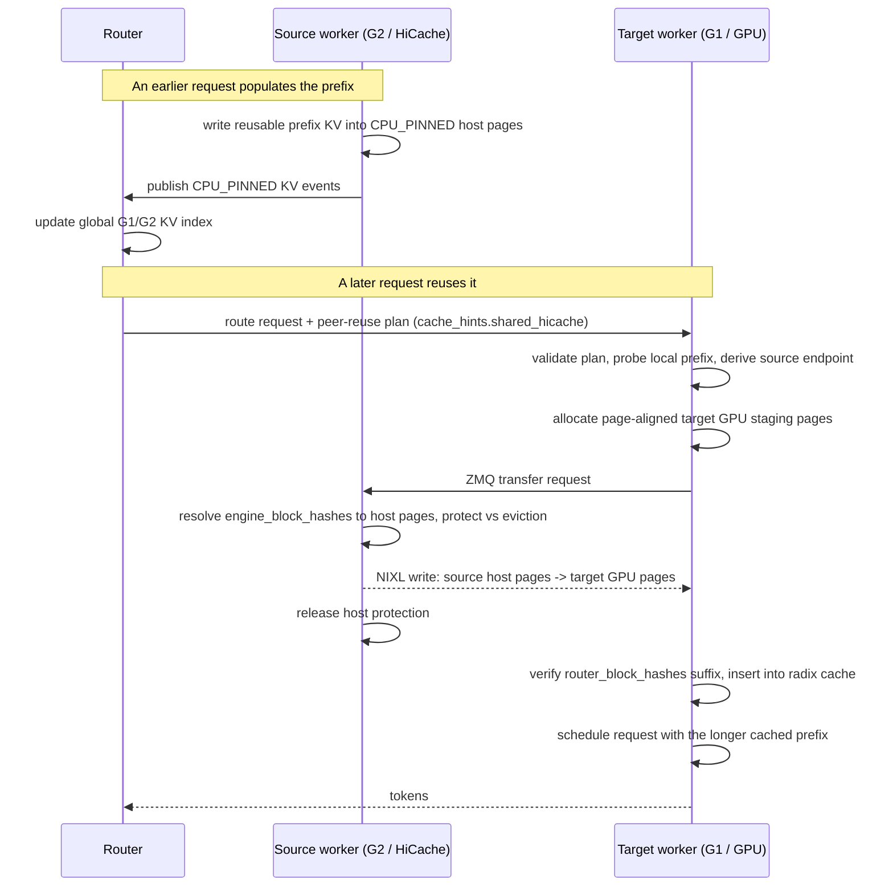
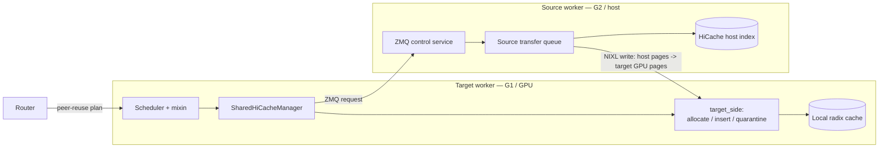
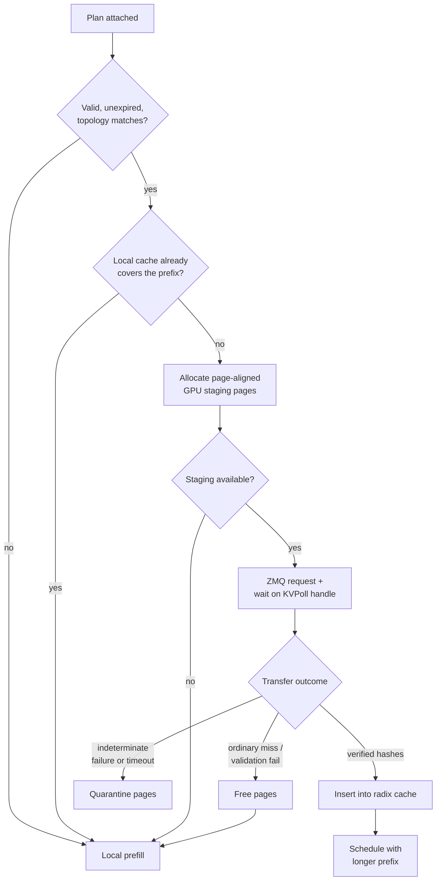

# RFC: Shared HiCache

> [!NOTE]
> Shared HiCache is router-agnostic: any router that can index and track G1 (GPU) and G2 (host) KV cache placement across workers can drive it. We implemented and validated this design with the Dynamo KV router, which has exactly that knowledge of G1 and G2 through its indexer and KV events. The rest of this document refers to that component simply as the "router".

## Summary

Shared HiCache lets one SGLang worker reuse another worker's HiCache host-tier KV blocks when an external router provides an explicit plan.

The first supported path is:

```text
source worker CPU_PINNED HiCache pages
  -> NIXL direct transfer
  -> target worker GPU KV pages
  -> target radix-cache insert
```

This is the concrete implementation linked from the higher-level [Programmatic KV Cache RFC](PROGRAMMATIC_KV_CACHE_RFC_V2.md).

## Motivation

The router observes KV-cache placement globally through SGLang KV events. It can know that worker A has a prefix in HostPinned memory while worker B is the better target for load, placement, or admission.

Without Shared HiCache, routing to worker B means worker B recomputes the prefix. With Shared HiCache, the router routes to worker B and sends a peer reuse plan. SGLang then pulls the reusable host KV from worker A into worker B's GPU KV cache before prefill.

## Non-Goals

Shared HiCache is not:

- a generic `HiCacheStorage` backend;
- a public user-facing API;
- a replacement for local prefix matching;
- a requirement that the backend obey every router plan;
- a Mooncake Store path;
- support for every model/topology in the first PR.

The current PR is a default-off, NIXL-backed, peer-worker reuse path.

## Design

Shared HiCache sits between a cache-aware router and SGLang's HiCache. The router keeps a global view of where every prefix lives across workers — both G1 (GPU) and G2 (host / CPU-pinned) tiers — built from the KV events SGLang already emits. When it routes a request to a worker that is missing a prefix some other worker holds in G2, it attaches a peer-reuse plan.

SGLang treats that plan as advice, not a command. The target worker allocates GPU staging pages, pulls the host KV directly from the source worker over NIXL, inserts the transferred blocks into its local radix cache, and then prefills only the uncovered suffix. Two properties shape the whole design: it **reuses SGLang's proven disaggregation transport** instead of inventing a new one, and it is **intentionally lightweight** — a self-contained module plus a few non-invasive scheduler hooks, with zero cost on the un-hinted path.

### Why these choices

**Orchestration layer, not a `HiCacheStorage` backend.** `HiCacheStorage` (`batch_exists` / `batch_get` / `batch_set`, content-addressed, landing in host memory) models L3 stores like Mooncake. Shared HiCache does not fit that shape: the source is another worker's *live* HiCache host tier, the lookup is by router-provided block hashes against protected radix nodes, and bytes land directly in target *GPU* slots. Implementing it as a storage subclass would fake that API and blur storage lifecycle with peer-write lifecycle, so it stays an orchestration layer over HiCache host-tier primitives.

**Router plans, SGLang stays authoritative.** The router owns global placement and emits the plan; SGLang owns allocation, eviction protection, validation, and insertion. The plan is advisory — any inconsistency falls back to local prefill, so a wrong or stale plan can never corrupt cache state.

**Target drives, source protects.** The target owns the transfer: it allocates the destination GPU pages and requests the data; the source then writes into those pages over NIXL. The source's one hard obligation is protect-vs-evict atomicity — once it accepts, it must not let host eviction reclaim the backing pages mid-read. Safety stays local to each side instead of needing a distributed lock.

**Endpoint derivation over a registry.** Plans carry `source_host` plus `source_bootstrap_port`; the target computes each source rank's endpoint as `base_port + tp_rank`. This reuses the disaggregation addressing model and keeps a Shared HiCache route registry out of the data path.

**Fail-open, quarantine the ambiguous case.** Every ordinary failure degrades to local prefill (see Failure Semantics). The one exception is an indeterminate direct transfer: if the source may still be writing target GPU pages after a timeout, those pages are quarantined instead of freed, since returning them to the allocator could expose them to a late peer write.

### Built on disaggregation

Cross-worker KV movement is the hard, safety-critical part — and SGLang already solved it for prefill/decode (PD) disaggregation. Shared HiCache deliberately rides those battle-tested primitives instead of building a parallel transport:

- **Bootstrap addressing** — `source_host` + `source_bootstrap_port` + rank offset, the same scheme disagg uses to reach a specific worker rank.
- **ZMQ PUSH/PULL control plane** — the transfer-metadata path mirrors disagg's.
- **`KVPoll` transfer handles** — the same `Transferring` / `Success` / `Failed` poll state machine the decode side waits on (including "a positive source completion is not yet a readiness signal").
- **NIXL transfer engine** — the prep / make-descriptor registration and transfer flow is adapted from the disagg NIXL path.
- **`StorageMedium` KV-event types** — reused as-is (`CPU_PINNED`), not a new feature-specific tier taxonomy.
- **TP-rank MIN status reduction** — all ranks converge on one prefix length, with a less-advanced rank dominating, exactly like disagg's ordered status polling.

Because the movement path is already proven under production disaggregation load, the genuinely new code is mostly orchestration on top of it.

### Lightweight by construction

The change is almost entirely additive — it removes only a couple dozen lines from existing files. The vast majority of the logic is one self-contained package, `shared_hicache/`. The only core-engine touch points are a scheduler mixin with a handful of thin call sites, a single request field, additive HiCache host-index primitives, the CLI flags, and metrics. Disabled (the default), none of it sits on the request path. The exact surface is listed under [Implementation](#implementation).

## Request Hint

The router attaches the plan to the request under the generic `cache_hints` envelope. SGLang normalizes it into a `SharedHiCachePlan`. The essential fields:

```json
{
  "cache_hints": {
    "shared_hicache": {
      "plan_id": "router-generated-id",
      "request_id": "request-id",
      "source_worker_id": "source-worker-uuid",
      "target_worker_id": "target-worker-uuid",
      "source_host": "10.0.0.11",
      "source_bootstrap_port": 41000,
      "source_tp_rank": 0,
      "source_medium": "CPU_PINNED",
      "router_block_hashes": [123, 456, 789],
      "engine_block_hashes": [123, 456, 789],
      "planned_prefix_blocks": 3,
      "block_size_tokens": 64,
      "expires_at_ms": 1760000001000
    }
  }
}
```

Plan version, TP sizes/ranks, and `start_block_index` are carried as well; see `shared_hicache/plan.py` for the full schema. Two fields deserve explanation.

**Two block-hash arrays.** `router_block_hashes` are the router's block identities — they preserve plan order and label the pages handed back to the target. `engine_block_hashes` are the source worker's HostPinned lookup keys, taken straight from SGLang KV events; the source host index is keyed by them. They are parallel arrays today because the router and SGLang do not yet share one canonical block-hash contract (same representation, hash algorithm, and parent-chaining). When they do, the source-lookup field collapses into `router_block_hashes`.

**No concrete source endpoint.** The plan advertises `source_host` and `source_bootstrap_port`, not a wire address. The target derives the source TP-rank control endpoint itself:

```text
tcp://<source_host>:<source_bootstrap_port + source_tp_rank>
```

SGLang validates the plan strictly and falls back to local prefill on any mismatch: `cache_hints` must be a dict with one hint object per batched request, `parallel_sample_num > 1` is rejected, integer fields must be real integers, worker ids must be non-empty strings, the target id must match the local worker, source and target must differ, `source_medium` must be `CPU_PINNED`, and plan version / expiry / block size / TP rank / TP size must all be consistent. Stale `source_endpoint` payloads are rejected in favor of `source_host`/`source_bootstrap_port`.

## Request Flow



## Contracts

Three components share responsibility for a transfer, and safety is kept local to each: the router plans, the target owns allocation / verification / insertion, and the source owns its bytes.



### Source-side contract

The source worker is authoritative for the source bytes. It must:

- resolve `engine_block_hashes` against live HiCache host pages;
- protect accepted host nodes before transfer;
- reject stale or missing pages, a non-`CPU_PINNED` medium, or an incompatible topology / worker id;
- release protection on success, failure, timeout, or cancellation.

The core invariant is **protect-vs-evict atomicity**: the source may reject, but it must never accept and then let host eviction invalidate the backing pages while the target is reading them.

### Target-side contract

The target owns allocation, safety, and cache insertion. Its lifecycle — and the three ways a transfer can end — looks like this:



Precise requirements:

- allocate page-aligned GPU KV blocks, evicting local GPU KV first when needed, and fall back to partial page-aligned staging when full capacity is not free;
- clip requested hashes and expected pages to the granted staging capacity;
- verify returned pages match the expected contiguous `router_block_hashes` suffix before inserting;
- on an ordinary miss or validation failure, free the pages; on an indeterminate direct-transfer failure, **quarantine** them instead of returning them to the allocator;
- insert verified device pages into the local radix cache and report `shared_hicache` cached tokens.

### Scheduler contract

The scheduler keeps Shared HiCache from breaking TP-rank convergence. It:

- probes the local prefix before starting a remote transfer;
- uses TP-wide MIN reduction for status and prefix length (a less-advanced rank dominates), then clamps every rank to the common prefix length;
- skips the request while a transfer is pending;
- falls back to local prefill when any rank rejects the hint.

This is the same ordered-polling pattern disagg uses, so all ranks stay in lockstep.

## Failure Semantics

Shared HiCache is fail-open for normal misses:

- no hint -> local behavior;
- invalid hint -> local behavior;
- expired plan -> local behavior;
- source route unavailable -> local behavior;
- source missing pages -> local behavior;
- source cannot protect pages -> local behavior;
- target staging allocation unavailable -> local behavior;
- local cache already covers the requested prefix -> local behavior.

Indeterminate direct-transfer failures are handled differently. If target GPU pages may still be written after a timeout or backend error, the target quarantines those pages instead of returning them directly to the allocator.

## Configuration

SGLang flags:

```bash
--enable-hierarchical-cache                      # prerequisite
--enable-shared-hicache
--shared-hicache-transfer-backend nixl           # required when enabled
--shared-hicache-bootstrap-port <base-port>      # required when enabled
--shared-hicache-worker-id <worker-id>           # required for standalone; the router sets it
```

Rules:

- Shared HiCache requires `--enable-hierarchical-cache`.
- A transfer backend is required when enabled; `nixl` is the only supported value today.
- Worker id is an arbitrary non-empty string. Under a router it is set from the router's worker/endpoint id; standalone launches must pass `--shared-hicache-worker-id`.
- Every rank binds `tcp://<server_args.host>:<shared_hicache_bootstrap_port + tp_rank>`.
- For cross-process or cross-host reuse, launch the server with a bind host reachable at the advertised `source_host`, normally `--host 0.0.0.0`.
- Plans carry `source_host` and `source_bootstrap_port`; there is no Shared HiCache route registry and no request-carried `source_endpoint`. The router is responsible for discovering each worker's `source_host` and `source_bootstrap_port` (e.g. from worker runtime metadata) and placing them in the plan.
- The router assigns each worker's base port and passes it via `--shared-hicache-bootstrap-port`. When co-locating multiple workers on one host, base ports must be spaced by at least the TP width so the rank-offset port ranges do not overlap.
- The supported source medium is `CPU_PINNED`.
- Runtime parallelism and timeout are controlled by `SGLANG_SHARED_HICACHE_*` env vars: `SGLANG_SHARED_HICACHE_FETCH_WORKERS` (source worker threads, default `8`), `SGLANG_SHARED_HICACHE_TRANSFER_PARALLELISM` (per-transfer NIXL parallelism, default `8`), and `SGLANG_SHARED_HICACHE_TIMEOUT_SECS` (default `1.0`).
- High source-transfer worker counts (e.g. `SGLANG_SHARED_HICACHE_FETCH_WORKERS=8`) require sufficient memlock for NIXL/UCX registration.

## Performance

Two TP4 MiniMax-M2.7 workers on one 8x H100 NVL host, 4096-token exact prefix overlap. Compared against routing the same reuse through a Mooncake Store L3 backend:

| Metric | Shared HiCache + router | Mooncake Store |
|---|---:|---:|
| Remote cache-read tokens | 46080 | 37728 |
| Remote target avg latency | 2858.5 ms | 3902.9 ms |
| Remote target p95 latency | 3373.3 ms | 5462.6 ms |
| E2E reuse workflow | 9.723 s | 11.693 s |

## Implementation

The change is almost entirely additive — it removes only a couple dozen lines from existing files — and nearly all of the logic lives in one self-contained package.

**Self-contained module** — `python/sglang/srt/mem_cache/shared_hicache/`:

- `plan.py` — plan schema and validation;
- `config.py` — CLI / server-arg normalization;
- `manager.py` — scheduler facade, factory, lifecycle wiring;
- `scheduler_mixin.py` — the `SharedHiCacheSchedulerMixin` the `Scheduler` inherits;
- `target_side/` — target allocation, insertion, quarantine, and reuse FSM (`cache.py`, `pending.py`, `reuse.py`);
- `source.py` / `source_queue.py` — source host-page lookup, protection, and the source-side transfer worker queue;
- `service.py` / `control.py` / `topology.py` — ZMQ control plane, `KVPoll` transfer handles, and endpoint derivation;
- `transfer/` — NIXL transfer backend (`common.py`, `nixl.py`).

**Engine touch points** — small and additive:

- `managers/scheduler.py` — the mixin plus a handful of call sites (init, per-batch prepare, release on finish/abort, idle and shutdown);
- `managers/io_struct.py` / `managers/schedule_batch.py` — the `shared_hicache_plan` request field;
- `mem_cache/hiradix_cache.py` / `mem_cache/hicache_host_index.py` — protected host-page lookup and the block-hash → host-page index;
- `observability/metrics_collector.py` — `sglang:shared_hicache_*` metrics;
- `server_args.py` / `environ.py` — the CLI flags and env vars.

Tests live in `test/registered/hicache/test_shared_hicache.py`.
