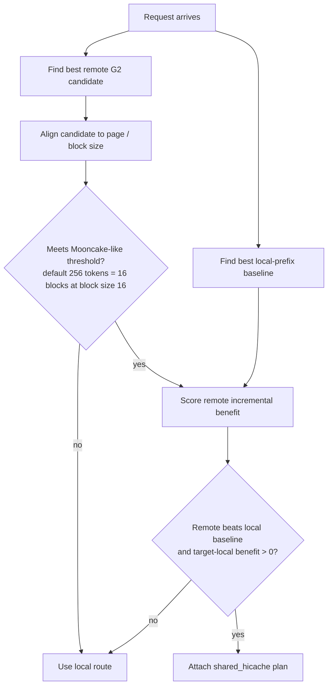
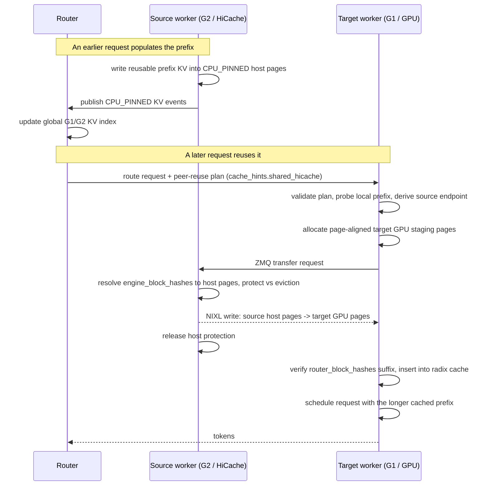
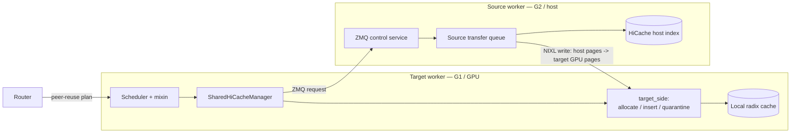
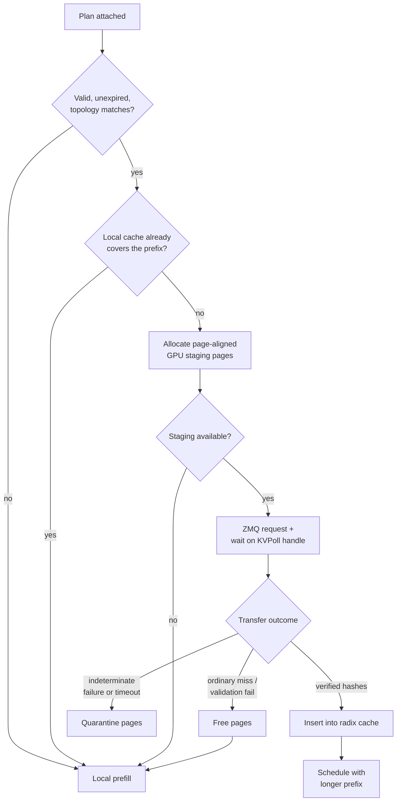

# RFC: Native Shared HiCache

> [!NOTE]
> Shared HiCache is router-agnostic: any router that can index and track G1 (GPU) and G2 (host) KV cache placement across workers can drive it. We implemented and validated this design with the Dynamo KV router, which has exactly that knowledge of G1 and G2 through its indexer and KV events. The rest of this document refers to that component simply as the "router".

## Summary

Shared HiCache lets one SGLang worker reuse another worker's HiCache host-tier KV blocks when an external router provides an explicit plan.

The first supported path is:

```text
source worker CPU_PINNED HiCache pages
  -> NIXL direct transfer
  -> target worker GPU KV pages
  -> target radix-cache insert
```

This is the concrete implementation linked from the higher-level [Programmatic KV Cache RFC](https://github.com/sgl-project/sglang/issues/27574).

## Status

SGLang has a working default-off implementation that we will upstream as a functionality PR. Out-of-the-box performance depends on the router's admission policy.

Current benchmark evidence is mixed and should be read conservatively:

- The old capped Direct G2 policy produced real NIXL transfers, but worsened TTFT and latency.
- Pivot scoring with the old conservative cost gate avoided bad pulls, but produced zero Direct G2 plans.
- The current moonmatch/default benchmark is being relaunched because the first run used a mismatched model id; that invalidation is not a router or SGLang Shared HiCache failure.

## Motivation

The router observes KV-cache placement globally through SGLang KV events. It can know that worker A has a prefix in HostPinned memory while worker B is the better target for load, placement, or admission.

Without Shared HiCache, routing to worker B means worker B recomputes the prefix. With Shared HiCache, the router routes to worker B and sends a peer reuse plan. SGLang then pulls the reusable host KV from worker A into worker B's GPU KV cache before prefill.

## Non-Goals

Shared HiCache is not:

- a generic `HiCacheStorage` backend;
- a public user-facing API;
- a replacement for local prefix matching;
- a requirement that the backend obey every router plan;
- a Mooncake Store path;
- support for every model/topology in the first PR.

The current PR is a default-off, NIXL-backed, peer-worker reuse path.

## Design

Shared HiCache sits between a cache-aware router and SGLang's HiCache. The router keeps a global view of where every prefix lives across workers — both G1 (GPU) and G2 (host / CPU-pinned) tiers — built from the KV events SGLang already emits. When it routes a request to a worker that is missing a prefix some other worker holds in G2, it attaches a peer-reuse plan.

SGLang treats that plan as advice, not a command. The target worker allocates GPU staging pages, pulls the host KV directly from the source worker over NIXL, inserts the transferred blocks into its local radix cache, and then prefills only the uncovered suffix. Two properties shape the whole design: it **reuses SGLang's proven disaggregation transport** instead of inventing a new one, and it is **intentionally lightweight** — a self-contained module plus a few non-invasive scheduler hooks, with zero cost on the un-hinted path.

### Mooncake-compatible Direct G2 routing

Direct G2 routing has pivoted to model native SGLang HiCache / Mooncake behavior rather than the older capped, high-cost remote-pull model.

Native SGLang enqueues storage prefetch from the scheduler, aligns cache work to page size, and applies a prefetch threshold before treating remote reuse as worth waiting for. The default threshold is 256 tokens, which maps to 16 KV blocks for 16-token blocks. There is no fixed 512-block cap. The default timeout policy uses a bounded timeout computed from base timeout plus per-1K-token timeout, capped at 30 seconds.

Dynamo's Direct G2 defaults now match that surface: `remote_g2_cost_blocks=16.0`, `remote_g2_cost_per_block=0.0`, and `remote_g2_max_planned_blocks=None` (no cap). Routing compares the remote G2 incremental benefit against the best local-prefix baseline, and still requires the target-local incremental benefit to be greater than zero.



The design intent is narrow: the router may plan a direct worker-to-worker top-up only when remote G2 locality beats the local baseline enough to satisfy Mooncake-like admission, and the SGLang target may stop or decline the pull when the active HiCache prefetch policy says the pull is no longer beneficial or needed.

### Built on disaggregation

Cross-worker KV movement is the hard, safety-critical part — and SGLang already solved it for prefill/decode (PD) disaggregation. Shared HiCache deliberately rides those battle-tested primitives instead of building a parallel transport:

- **Bootstrap addressing** — `source_host` + `source_bootstrap_port` + rank offset, the same scheme disagg uses to reach a specific worker rank.
- **ZMQ PUSH/PULL control plane** — the transfer-metadata path mirrors disagg's.
- **`KVPoll` transfer handles** — the same `Transferring` / `Success` / `Failed` poll state machine the decode side waits on (including "a positive source completion is not yet a readiness signal").
- **NIXL transfer engine** — the prep / make-descriptor registration and transfer flow is adapted from the disagg NIXL path.
- **`StorageMedium` KV-event types** — reused as-is (`CPU_PINNED`), not a new feature-specific tier taxonomy.
- **TP-rank MIN status reduction** — all ranks converge on one prefix length, with a less-advanced rank dominating, exactly like disagg's ordered status polling.

A roadmap item is to abstract out some of our NIXL/disaggregation APIs in order to build newer P2P flows on top of them.

### Lightweight by construction

The change is almost entirely additive — it removes only a couple dozen lines from existing files — and nearly all of the logic lives in one self-contained package.

**Self-contained module** — `python/sglang/srt/mem_cache/shared_hicache/`:

- `plan.py` — plan schema and validation;
- `config.py` — CLI / server-arg normalization;
- `manager.py` — scheduler facade, factory, lifecycle wiring;
- `scheduler_mixin.py` — the `SharedHiCacheSchedulerMixin` the `Scheduler` inherits;
- `target_side/` — target allocation, insertion, quarantine, and reuse FSM (`cache.py`, `pending.py`, `reuse.py`);
- `source.py` / `source_queue.py` — source host-page lookup, protection, and the source-side transfer worker queue;
- `service.py` / `control.py` / `topology.py` — ZMQ control plane, `KVPoll` transfer handles, and endpoint derivation;
- `transfer/` — NIXL transfer backend (`common.py`, `nixl.py`).

**Engine touch points** — small and additive:

- `managers/scheduler.py` — the mixin plus a handful of call sites (init, per-batch prepare, release on finish/abort, idle and shutdown);
- `managers/io_struct.py` / `managers/schedule_batch.py` — the `shared_hicache_plan` request field;
- `mem_cache/hiradix_cache.py` / `mem_cache/hicache_host_index.py` — protected host-page lookup and the block-hash → host-page index;
- `observability/metrics_collector.py` — `sglang:shared_hicache_*` metrics;
- `server_args.py` / `environ.py` — the CLI flags and env vars.

## Request Hint

The router attaches the plan to the request under the generic `cache_hints` envelope. This `cache_hints` is discussed in [Programmatic KV Cache RFC](https://github.com/sgl-project/sglang/issues/27574) and will be used for further programmatic kv cache hints. 

```json
{
  "cache_hints": {
    "shared_hicache": {
      "plan_id": "router-generated-id",
      "request_id": "request-id",
      "source_worker_id": "source-worker-uuid",
      "target_worker_id": "target-worker-uuid",
      "source_host": "10.0.0.11",
      "source_bootstrap_port": 41000,
      "source_tp_rank": 0,
      "source_medium": "CPU_PINNED",
      "router_block_hashes": [123, 456, 789],
      "engine_block_hashes": [123, 456, 789],
      "planned_prefix_blocks": 3,
      "block_size_tokens": 64,
      "expires_at_ms": 1760000001000
    }
  }
}
```

This API is still a WIP and has rooom to be simplified (ie `source_host` + `source_boostrap_port` should be inferred from a registry). We can also remove the `source_medium` since for now we will only go from G2 -> G1.

**Two block-hash arrays.** `router_block_hashes` are the router's block identities — they preserve plan order and label the pages handed back to the target. `engine_block_hashes` are the source worker's HostPinned lookup keys, taken straight from SGLang KV events; the source host index is keyed by them. They are parallel arrays today because some routers and SGLang do not yet share one canonical block-hash contract (same representation, hash algorithm, and parent-chaining). When they do, the source-lookup field collapses into `router_block_hashes`. A roadmap item here could be to have an environment variable (say `SGLANG_HASH_ALGORITHM`) in order for them to match.

## Request Flow



## Contracts

Three components share responsibility for a transfer, and safety is kept local to each: the router plans, the target owns allocation / verification / insertion, and the source owns its bytes.



### Source-side contract

The source worker is authoritative for the source bytes. It must:

- resolve `engine_block_hashes` against live HiCache host pages;
- protect accepted host nodes before transfer;
- reject stale or missing pages, a non-`CPU_PINNED` medium, or an incompatible topology / worker id;
- release protection on success, failure, timeout, or cancellation.

The core invariant is **protect-vs-evict atomicity**: the source may reject, but it must never accept and then let host eviction invalidate the backing pages while the target is reading them.

### Target-side contract

The target owns allocation, safety, and cache insertion. Its lifecycle — and the three ways a transfer can end — looks like this:



Precise requirements:

- allocate page-aligned GPU KV blocks, evicting local GPU KV first when needed, and fall back to partial page-aligned staging when full capacity is not free;
- reserve target tokens for remote-KV staging before starting the transfer;
- clip requested hashes and expected pages to the granted staging capacity;
- pass `hicache_storage_prefetch_policy` into target reuse and honor it there; in default timeout mode, use the same bounded timeout family as native HiCache and cap the wait at 30 seconds;
- decline or finish as a no-op when the local cache already covers the planned prefix;
- verify returned pages match the expected contiguous `router_block_hashes` suffix before inserting;
- on an ordinary miss or validation failure, free the pages; on an indeterminate direct-transfer failure, **quarantine** them instead of returning them to the allocator;
- insert verified device pages into the local radix cache and report `shared_hicache` cached tokens.

### Scheduler contract

The scheduler keeps Shared HiCache from breaking TP-rank convergence. It:

- probes the local prefix before starting a remote transfer;
- uses TP-wide MIN reduction for status and prefix length (a less-advanced rank dominates), then clamps every rank to the common prefix length;
- skips the request while a transfer is pending;
- falls back to local prefill when any rank rejects the hint.

This is the same ordered-polling pattern disagg uses, so all ranks stay in lockstep.

## Failure Semantics

Shared HiCache is fail-open for normal misses:

- no hint -> local behavior;
- invalid hint -> local behavior;
- expired plan -> local behavior;
- source route unavailable -> local behavior;
- source missing pages -> local behavior;
- source cannot protect pages -> local behavior;
- target staging allocation unavailable -> local behavior;
- local cache already covers the requested prefix -> local behavior.

Indeterminate direct-transfer failures are handled differently. If target GPU pages may still be written after a timeout or backend error, the target quarantines those pages instead of returning them directly to the allocator.
