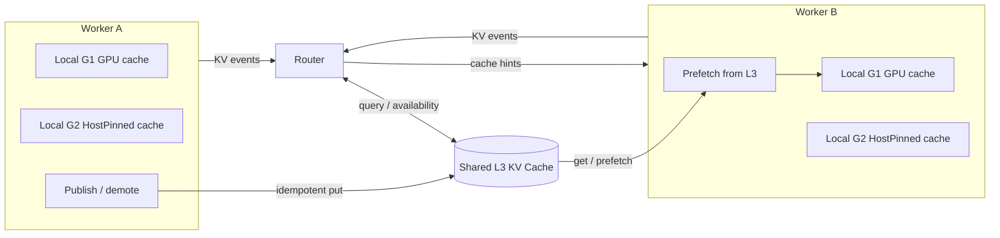
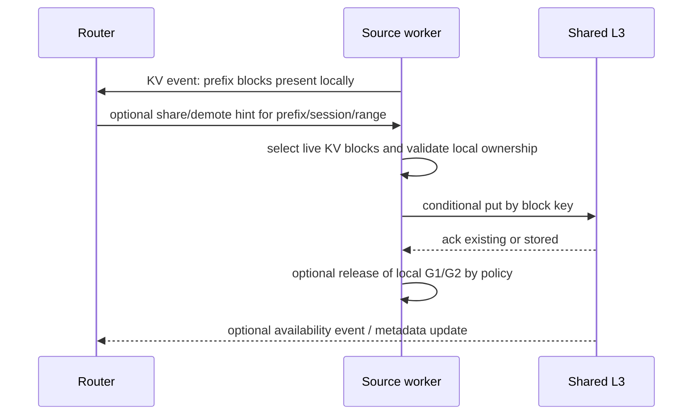
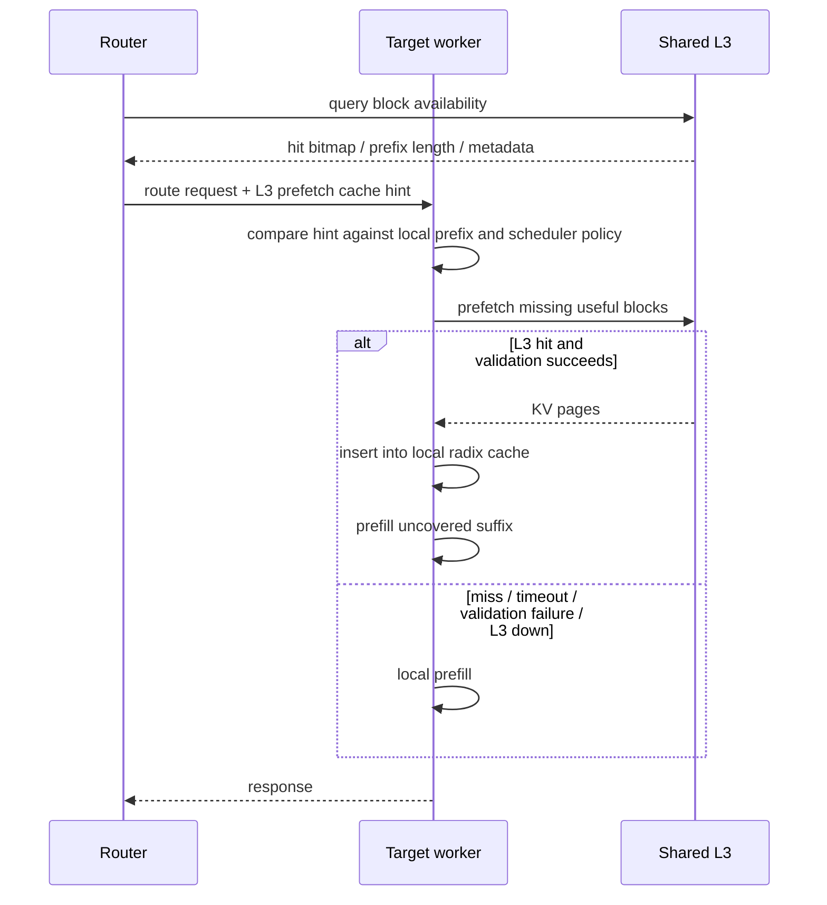

# Design: Router-Integrated Shared L3 KV Cache

## Summary

This document proposes an L3-first version of Shared HiCache.

The core change is semantic: **Share should not mean "worker A sends KV directly to worker B."** Share should mean "make this KV available through a shared cache tier." A target worker then uses ordinary **prefetch** from that shared tier. Direct worker-to-worker transfer can remain a later optimization for tightly scoped cases, but it should not be the default contract exposed to routers.

```text
Source worker
  -> publish / demote KV blocks to shared L3
  -> optionally release L1/L2 after L3 ack

Router
  -> observes worker KV events
  -> queries / tracks shared L3 block availability
  -> routes request with cache hints

Target worker
  -> prefetches reusable KV blocks from shared L3
  -> falls back to local prefill on miss, timeout, or L3 failure
```

This keeps worker-to-worker dependencies out of the normal inference path:

```text
Allowed:
  router <-> workers
  router <-> L3
  workers <-> L3
  prefill <-> decode for explicit P/D disaggregation

Avoided by default:
  arbitrary worker <-> arbitrary worker cache transfer
```

## Motivation

The direct peer-transfer design is useful as a proof that SGLang can materialize remote KV into a target worker. It also exposes real operational concerns:

- A source worker becomes part of another request's critical path.
- Source worker restarts increase blast radius.
- Routers can accidentally fan out duplicate share operations to the same source.
- Source-side eviction and transfer lifetimes require careful pin / unpin protocols.
- Cold-started workers can put load on already-hot workers.
- Compatibility between different worker layouts must be checked before transfer.

External L3 storage changes the dependency graph. The source writes once to a shared tier; any target reads from that tier. If L3 is down or missing data, the request degrades to ordinary prefill. That matches the desired availability model: KV cache is best effort and must not determine the serving SLA.

## Design Goals

1. **Fail open.** L3 miss, timeout, corruption detection, or outage must become local prefill.
2. **No worker serving dependency.** A worker should not depend on another arbitrary worker to serve an inference request.
3. **Router-integrated, not router-owned.** The router can query L3 and pass hints, but SGLang owns memory, scheduling, validation, and final accept/reject.
4. **Idempotent shared placement.** Publishing the same block multiple times should converge to one L3 object.
5. **Bounded duplication.** Workers may keep hot L1/L2 copies, but the shared durable copy is L3.
6. **Compatibility by key.** Incompatible model/layout/topology changes should produce cache misses, not transfer-time protocol errors.
7. **P2P remains optional.** Direct NIXL worker-to-worker can be a backend for special cases, not the default API contract.

## Proposed Semantics

### Share

Share becomes a logical operation:

```text
share(prefix/session/range, policy)
  = publish matching KV blocks into shared L3
  + optionally demote/release local L1/L2 after L3 ack
```

The source worker does not need to know the target worker. It only needs to know which local KV ranges to publish and what release policy is safe after the publish completes.

Possible release policies:

| Policy | Meaning |
|---|---|
| `publish_only` | Write to L3, keep local L1/L2 unchanged. |
| `demote_after_ack` | Write to L3, release GPU copy after L3 ack. |
| `release_host_after_ack` | Write to L3, release HostPinned copy after L3 ack if no local ref needs it. |
| `best_effort_background` | Publish asynchronously; request path must not wait. |

### Prefetch

Prefetch is the target-side operation:

```text
prefetch(prefix/session/range, source = shared_l3)
  -> target asks L3 for reusable KV blocks
  -> target validates metadata and layout
  -> target inserts verified pages into local radix cache
  -> target prefills the uncovered suffix
```

The target never requires the original source worker to be alive.

### Demote

Demote moves local KV to a colder tier:

```text
demote(prefix/session/range, tier = shared_l3)
  -> write to L3
  -> release hotter local tier after ack
```

This is the natural paired operation for long tool gaps, subagent suspension, scale-down, and memory-pressure relief.

## Architecture



The router has two sources of cache locality:

- worker KV events for local G1/G2 placement;
- L3 metadata or query results for shared availability.

The router's decision becomes:

```text
1. Find best local worker by G1/G2 overlap and load.
2. Query or consult L3 availability for the request prefix.
3. If L3 reuse beats local prefill by policy threshold:
     route to chosen target with L3 prefetch hint.
   Else:
     route normally.
```

The target still decides whether to wait. The hint is advice.

## Request Flow

### Publish / Demote



### Target Reuse



## Cache Key and Compatibility

L3 must key KV blocks by both content identity and execution layout. Incompatible workers should miss by construction.

A practical key should include:

- model identity and revision;
- tokenizer / prompt-tokenization identity;
- KV block size and hash algorithm;
- KV dtype / quantization;
- attention layout, including MLA/MHA and any hybrid attention dimensions;
- TP size and attention-TP size;
- PP placement if KV layout differs by stage;
- cache layout version;
- storage backend encoding version.

This avoids rare but dangerous cases where workers with different layouts attempt to exchange KV. With L3, a redeploy or topology change simply creates a different key space unless explicitly marked compatible.

## Router Replica Coordination

Direct P2P share requires router replicas to coordinate in-flight transfers. Otherwise, two routers can independently decide to ask the same source worker to send the same or similar KV to different targets, amplifying load on the source.

With L3-first Share, the operation is naturally closer to idempotent:

```text
put(block_key, bytes)
  -> already exists: no-op / ref metadata update
  -> missing: store once
```

L3 can additionally expose:

- conditional put / compare-and-set;
- in-flight publish leases;
- per-block or per-prefix "already materialized" metadata;
- admission limits for publish bandwidth;
- TTL / priority metadata controlled by the router or worker.

Router replicas do not need to synchronize every share decision with each other. Duplicate decisions collapse at L3.

## Failure Model

| Failure | L3-first behavior | Direct P2P behavior to avoid as default |
|---|---|---|
| Source worker restarts after publish | Target still reads from L3. | Target request may fail or fall back after waiting on source. |
| Source worker restarts before publish | L3 miss; local prefill. | Target may depend on dead source if plan is stale. |
| Target worker restarts during prefetch | L3 copy remains; retry elsewhere. | Source needs transfer cleanup / unpin handling. |
| L3 unavailable | Local prefill; cache SLA degraded only. | Not applicable, but P2P may still couple worker health. |
| Duplicate router share decisions | Conditional put collapses duplicates. | Multiple transfers can hit one source worker. |
| Source evicts local blocks | Safe after L3 ack; otherwise publish fails. | Requires source pinning until target transfer completes. |
| Worker layout changes | Different L3 key; cache miss. | Must validate before peer transfer or risk corruption. |

## Space Model

The L3-first design does not eliminate duplication, but it makes duplication intentional:

```text
L3 copy: shared, durable best-effort cache
L2 HostPinned copy: local hot / writeback buffer
L1 GPU copy: local execution cache
```

The release policy determines how much duplication remains after publish:

- hot prefixes may keep G1/G2 and L3;
- paused sessions may demote to L3 and release G1;
- scale-down may publish to L3 and release both G1 and G2;
- failed or slow publish leaves the local cache unchanged and can be retried later.

This is easier to reason about than a target-specific duplicate created by direct Share.

## Availability and SLA

L3 is a best-effort cache tier, not a required serving dependency.

Required behavior:

- bounded prefetch timeout;
- local prefill on every L3 error class;
- metrics for hit, miss, timeout, validation failure, and fallback;
- no request should wait on L3 indefinitely;
- no target should require source worker liveness for L3-backed reuse.

If L3 dies, the system loses shared cache hit rate, not request availability.

## Operational Implications

### Autoscaling

Cold workers should warm from L3, not by requesting many active workers to serve cache transfers. This keeps scale-up from overloading the warm fleet.

### Redeploys

New workers can read compatible L3 objects. If a deployment changes attention layout, TP size, KV dtype, or block format, the cache key changes and old objects become misses.

### Source Worker Load

Publishing can be backgrounded, rate-limited, and prioritized by local scheduler state. Target prefetch load goes to L3, not the source worker's PCIe / host memory path.

### Router Simplicity

The router selects between:

- route to a worker with local G1/G2 hit;
- route to a worker and attach an L3 prefetch hint;
- route normally and prefill.

It does not need to manage source transfer leases, source endpoint health, target-specific fanout, or source-side cleanup after target failure.

## API Sketch

The exact field names are intentionally provisional. The important part is that plans refer to shared-cache identity, not source worker endpoints.

### Request Hint

```json
{
  "cache_hints": {
    "shared_l3_prefetch": {
      "plan_id": "router-generated-id",
      "request_id": "request-id",
      "cache_namespace": "model-layout-cache-key",
      "block_hashes": [123, 456, 789],
      "planned_prefix_blocks": 3,
      "block_size_tokens": 64,
      "min_tokens_to_wait": 256,
      "expires_at_ms": 1760000001000
    }
  }
}
```

### Lifecycle Hint

```json
{
  "cache_hints": {
    "shared_l3_demote": {
      "session_id": "session-id",
      "token_range": [0, 8192],
      "release_policy": "demote_after_ack",
      "ttl_ms": 600000,
      "priority": 80
    }
  }
}
```

## Relationship to Mooncake Store

Mooncake Store is currently the closest existing mechanism to this design:

- it already provides a shared L3 tier;
- it avoids arbitrary worker-to-worker request dependencies;
- its block store can make duplicate writes idempotent;
- SGLang already knows how to prefetch from it.

The gap is router integration. The router needs a first-class way to know L3 locality and to express prefetch/demote intent without treating Mooncake Store as an opaque internal engine detail.

The desired direction is:

```text
Mooncake Store / shared L3 handles data placement.
SGLang handles local scheduling, validation, prefetch, and fallback.
Router handles global placement policy and request admission.
```

## Relationship to Direct P2P Shared HiCache

Direct P2P remains valuable as a narrowly scoped optimization:

- same-host request migration;
- tightly controlled same-failure-domain deployments;
- emergency transfer where L3 is not available but the operator accepts coupling;
- future fast path after the L3 abstraction is proven.

However, it should not be the required implementation of Share because it expands the failure domain and makes arbitrary workers serving dependencies for each other.

The current direct-transfer work can still inform:

- target-side radix insertion;
- cache-hint validation;
- cached-token attribution;
- scheduler fail-open behavior;
- block-hash / layout compatibility checks;
- transfer metrics.

## Open Questions

1. What is the minimal L3 query API the router needs: exact block query, prefix query, session query, or all three?
2. Should publish/demote be worker-initiated from local policy, router-initiated by lifecycle hint, or both?
3. Where should L3 availability events be emitted: from SGLang workers, from L3 itself, or both?
4. What is the first cache-key compatibility contract SGLang can commit to?
5. How should TTL and priority map to existing HiCache / Mooncake Store eviction policy?
6. Do we need a router-visible publish lease API, or are conditional puts enough for the first version?

## Recommendation

For upstream design review, lead with the L3-first architecture:

1. Define Share as publish/demote to shared L3.
2. Define Prefetch as target-side load from shared L3.
3. Keep request-time hints soft and fail-open.
4. Integrate the router with L3 locality and SGLang cache hints.
5. Treat direct worker-to-worker transfer as a possible backend, not the foundation.

This keeps the operational model closer to existing production expectations: workers depend on an external best-effort cache tier, not on each other.
